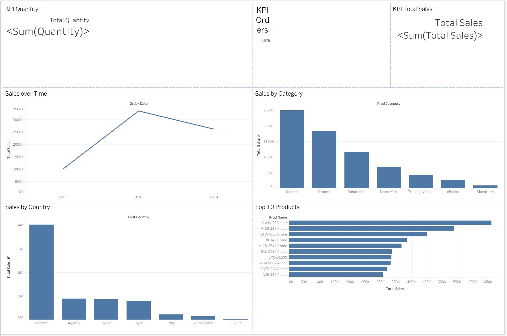

# 📊 Sales Performance Dashboard (Tableau)

Dieses Projekt visualisiert Verkaufsdaten aus einer Excel-Datei in einem interaktiven Tableau-Dashboard.  
Es zeigt die wichtigsten KPIs, Trends und Vergleiche aus verschiedenen Dimensionen wie Produktkategorie, Ländern und Produkten.

---

## 🚀 Features

### 🔹 KPIs
- **Total Sales** (Gesamtumsatz)
- **Total Quantity** (Gesamtmenge)
- **Number of Orders** (Anzahl Bestellungen)

### 🔹 Diagramme
- **Sales over Time** – Umsatzentwicklung über Jahre
- **Sales by Category** – Umsatz nach Produktkategorie
- **Sales by Country** – Umsatz nach Ländern
- **Top 10 Products** – Top-Produkte basierend auf Umsatz

---

## 🛠 Technologien
- Tableau Desktop / Tableau Public
- Excel (.xlsx)

---

## 📸 Dashboard-Vorschau

---

## 📥 Datenquelle
Die Excel-Datei enthält Felder wie:

- Order Date  
- Order Number  
- Product Category  
- Product Name  
- Customer Country  
- Price  
- Quantity  
- Total Sales (berechnet)

---

## ✨ Autor
**Obai Albek**

Erstellt als Portfolio-Projekt für Werkstudentenbewerbungen im Bereich Data Analytics & Business Intelligence.

---

